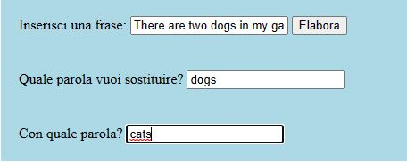
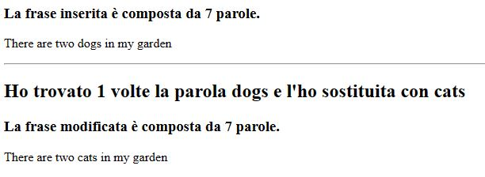

## Description
This is a simple PHP project to familiarize with the basics of the language. Users can insert phrases, which word replace and the replacement word. After sending this informations through a form, will be displayed a page with the following informations:

1. - How many words there are in the phrase
   - The phrase

2. - How many occurences founded
   - The modified phrase

FORM

RESULT

